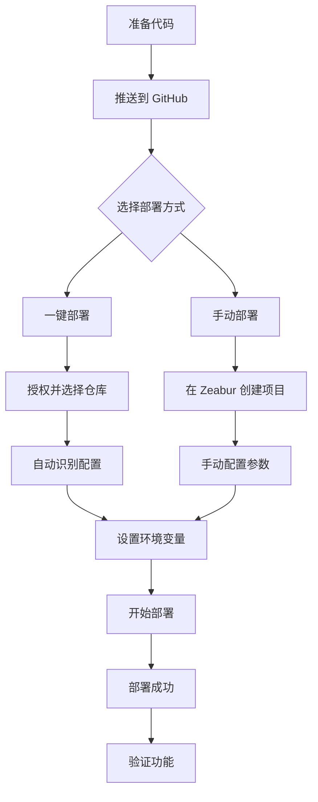

# Zeabur 部署检查清单 ✅

## 部署前检查

### 1. 项目配置 ✓
- [x] `zeabur.json` 已配置
  - 构建命令：`npm run build`
  - 输出目录：`dist`
  - 端口：8080
- [x] `Dockerfile` 已优化
  - 使用 Node.js 18
  - 包含构建步骤
  - 使用 serve 提供静态文件服务
- [x] `.dockerignore` 已配置
  - 排除 node_modules
  - 排除 dist
  - 排除 .env 文件

### 2. 环境变量 ⚠️
**需要在 Zeabur 控制台设置：**
- [ ] `VITE_SUPABASE_URL` - Supabase 项目 URL
- [ ] `VITE_SUPABASE_ANON_KEY` - Supabase 匿名密钥

### 3. 本地测试 ✓
```bash
# 运行以下命令验证
npm install      # 安装依赖
npm run build    # 构建项目 - 应该成功
npm run preview  # 预览构建结果
```

**当前状态：** ✅ 本地构建成功

### 4. Git 仓库准备
- [ ] 确保代码已推送到 GitHub
- [ ] 确认主分支名称（main/master）
- [ ] 检查 `.gitignore` 配置

### 5. Zeabur 部署步骤

#### 方法一：一键部署（最简单）
1. 点击 README.md 中的 "Deploy on Zeabur" 按钮
2. 授权 Zeabur 访问你的 GitHub
3. 选择要部署的仓库
4. Zeabur 会自动识别配置并开始部署

#### 方法二：手动部署
1. 登录 [Zeabur](https://zeabur.com)
2. 创建新项目
3. 选择 "GitHub" 作为数据源
4. 选择你的仓库
5. 确认配置：
   - Build Command: `npm run build`
   - Output Directory: `dist`
   - Port: 8080
6. 添加环境变量
7. 点击 "Deploy"

### 6. 部署后验证

部署成功后，检查以下内容：

#### 功能测试
- [ ] 网站可以正常访问
- [ ] 首页加载正常
- [ ] 导航链接正常工作
- [ ] 志愿者报名表单可以打开
- [ ] 学校入驻表单可以打开
- [ ] 管理后台登录页面正常

#### 性能检查
- [ ] 页面加载速度快
- [ ] 图片资源正常显示
- [ ] CSS 样式正确应用
- [ ] JavaScript 交互正常

#### 移动端适配
- [ ] 在手机浏览器上测试
- [ ] 响应式布局正常
- [ ] 触摸交互流畅

### 7. 故障排查

#### 如果构建失败：
1. 查看 Zeabur 部署日志
2. 确认 Node.js 版本 >= 18
3. 检查 package.json 依赖是否有冲突
4. 在本地运行 `npm run build` 验证

#### 如果页面空白：
1. 打开浏览器开发者工具
2. 查看 Console 错误信息
3. 检查 Network 请求是否成功
4. 确认环境变量已正确设置

#### 如果 API 调用失败：
1. 检查 Supabase 配置是否正确
2. 确认 CORS 设置
3. 验证 API 密钥是否有效

### 8. 自定义域（可选）

如果需要绑定自定义域名：
1. 进入 Zeabur 项目设置
2. 选择 "Domains"
3. 添加你的域名
4. 按照提示配置 DNS 记录
   - CNAME 记录指向 Zeabur 提供的地址

### 9. 自动部署（推荐）

启用自动部署后：
- 每次 push 到主分支都会自动构建和部署
- Pull Request 会创建预览部署
- 可以在 Zeabur 控制面板查看部署历史

### 10. 监控和维护

定期查看：
- Zeabur 控制面板的资源使用情况
- 部署日志
- 用户反馈

---

## 快速部署流程



## 常用命令

```bash
# 本地开发
npm run dev          # 启动开发服务器

# 构建测试
npm run build        # 构建生产版本
npm run preview      # 预览构建结果

# 代码检查
npm run lint         # 代码检查
npm run type-check   # TypeScript 类型检查
```

## 需要帮助？

- 📖 查看 [Zeabur 官方文档](https://zeabur.com/docs)
- 💬 加入 Zeabur Discord 社区
- 🐛 在项目 Issues 中提问
